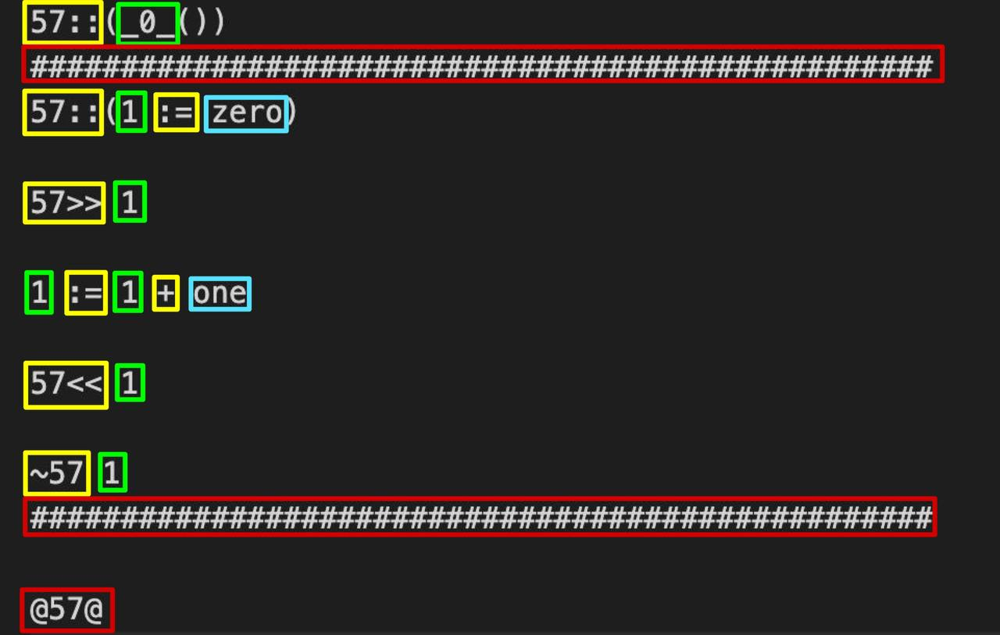
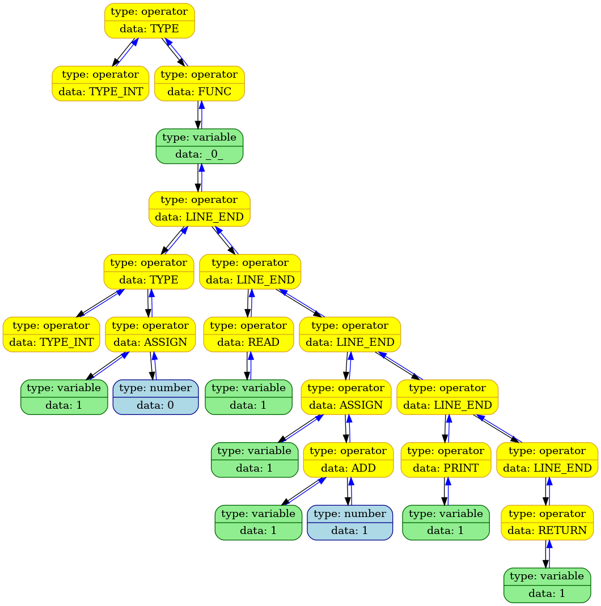
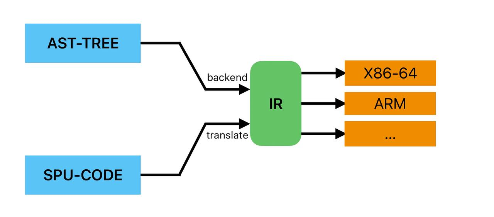
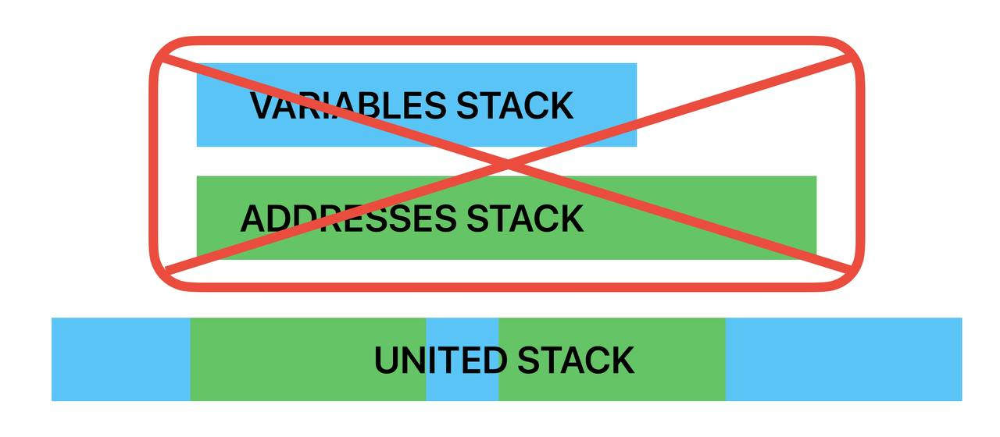
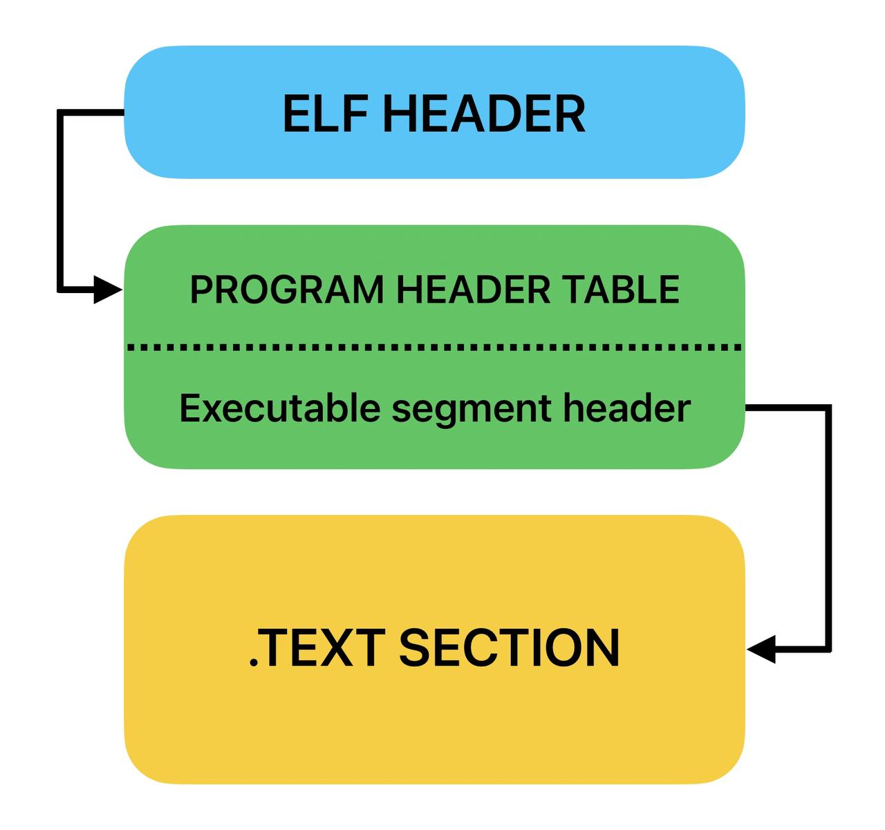
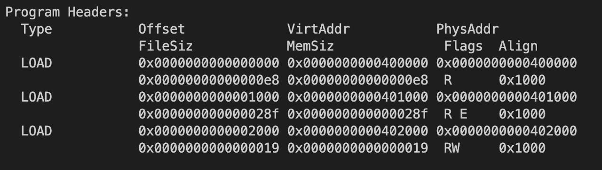

# Язык программирования "57Lang" + компилятор для архитектуры x86-64


### Скачивание (Linux)
```
git clone https://github.com/worthlane/x86compiler_for_57Lang
cd x86_compiler_for_57Lang
make makedirs
make all
```

### Запуск
```
chmod +x ./run.sh
./run.sh <имя файла> <флаги> ...
```
#### Доступные флаги
```-log``` - создает лог-файлы при запуске программы.  
```-s``` - создает файл с ассемблерным кодом для nasm, который исполняет заданный код.  
```-O0``` - отключает компиляторную оптимизацию.  

# Содержание
1. [Язык](#Язык)
    1. [Описание](#Описание)
    2. [Синтаксис](#Синтаксис-языка)
        1. [Числа](#Числа)
        2. [Операции](#Операции)
        3. [Ключевые слова](#Ключевые-слова)
    3. [Грамматика](#Грамматика)
    4. [Схема работы программы](#Схема-работы-программы)
        1. [Frontend](#Frontend)
        2. [Middleend](#Middleend)
        3. [Backend](#Backend)
2. [Компилятор](#Компилятор)
    1. [IR](#IR)
          1. [Зачем это нужно?](#Зачем-это-нужно)
          2. [Трансляция из IR](#Трансляция-из-IR)
    2. [Создание ELF-файла](#Создание-ELF-файла)
         1. [Заголовки](#Заголовки)
         2. [Стандартная библиотека](#Стандартная-библиотека)
    3. [Сравнение скорости](#Сравнение-скорости)

## Язык

### Описание
57Lang - полный по Тьюрингу язык программирования.

### Синтаксис языка
Синтаксис может чем-то напоминать язык C++, но на самом деле между ними имеется большая разница.
1. В языке присутствует поддержка функций, рекурсии, циклов и блоков условий.
2. Все переменные имеют один тип. В переменной может храниться не целое знаковое число, но присвоить ей можно только целое значение.
3. Каждая функция обязана возвращать значение.
4. В программе должна присутствовать функция с названием ```_0_``` (альтернатива ```main``` в языке Си).
5. Язык поддерживает локальные переменные внутри циклов и условных блоков, глобальные переменные на данный момент недоступны.

#### Числа
Одна из основных идей при написании языка - поменять между собой роль цифр и букв в обычных языках. Таким образом все числа в этом языке должны задаваться словами.

```
0 = zero  
1 = one  
2 = two  
3 = three  
4 = four  
5 = five  
6 = six  
7 = seven  
8 = eight  
9 = nine
```

Возможно, это станет понятней, если показать примеры таких чисел.

```
57   = five_seven
179  = one_seven_nine
-228 = -two_two_eight
```

#### Операции
Операции имеют интуитивный вид, здесь у меня не было мотива максимально усложнить программисту написание кода (в отличие от других частей😈😈😈).

```
... * ... - умножение
... / ... - деление
... + ... - сложение
... - ... - вычитание
```

#### Ключевые слова
Так как вместо цифр мы используем для представления чисел буквы, то будем представлять ключевые слова с помощью цифр и спец. знаков.

```
57?    = if
1000_7 = while
:=     = assignment
$1#    = sinus
57#    = sqrt
<0$    = cosinus
57>>   = input
57<<   = output
57::   = type
~57    = return
@57@   = end
.57    = end of block
```

Название переменной также является числом со специальными символами. Примеры корректных названий: ```3```, ```57_23```, ```57$$@_&23321```.

Для большей понятности приведу пример одного и того же рабочего кода на Си и на 57Lang.

C:
```C
int x = 0;
scanf("%d", &x);        // input
if (x == 1337)
{
  while (x)
  {
    x = x - 1;
  }
  printf("%d", x * 10); // output
}
```

57Lang:
```js
57::(1337 := zero)
57>> 1337               // input
57? (1337 == one_three_three_seven)
  1000_7 (1337)
    1337 := 1337 - one
  .57
  57<< 1337 * one_zero  //output
.57
```

В конце каждой программы должен стоять знак ```@57@```. (Задел на будущее, для возможности создания нескольких программ из одного текстового файла).
Стоит также обратить внимание, что условный блок или блок цикла начинается сразу после строчки его объявления, а заканчивается только при встрече оператора ```.57```.

Функция определяется следующим образом:
```js
57::(название(57::(переменная), 57::(переменная)))
##################################################

// код функции

~57 значение // функция обязательно должная возвращать значение
##################################################
```

Как вы можете видеть, блок функции отделяется большим количеством решеток. Это сделано ради того, чтобы в большом коде функции можно было различать между собой. Так как [некоторые люди](https://github.com/d3clane) высмеивали то, что я в контесте разграничиваю функции в Си комментарием из большого количества тире, я решил сделать эту особенность в своем языке обязательной. Говнокодеров будет корёжить от такого базированного языка, поэтому люди будут писать только чистый код.

Другие примеры кода можно найти в папке репозитория с названием ```examples```. Там содержится программа, считающая факториал числа, и программа, решающая квадратное уравнение.

#### Грамматика
Так как код распознается с помощью [рекурсивного спуска](https://ru.wikipedia.org/wiki/Метод_рекурсивного_спуска). Для людей, знакомых с данным алгоритмом, будет полезна грамматика, по которой считывается заданный текст.
```
// Program          ::= DefFunc Break {DefFunc Break}* END
// DefFunc          ::= Type NewFuncName L_BRACKET FuncVars R_BRACKET {LINE_END}* FUNC_WALL SubProgram FUNC_WALL
// CallVars         ::= L_BRACKET Expr { [,] Expr }* R_BRACKET
// CallFunc         ::= Name CallVars
// FuncVars         ::= OneFuncVar { [,] OneFuncVar }*
// OneFuncVar       ::= Type L_BRACKET Var R_BRACKET
// SubProgram       ::= Block
// WhileSection     ::= WHILE L_BRACKET Expression R_BRACKET {LINE_END}* Block BLOCK_END
// IfSection        ::= IF    L_BRACKET Expression R_BRACKET {LINE_END}* Block BLOCK_END
// Block            ::= {Line Break}*
// Line             ::= {IfSection | WhileSection | Return | Assignment | Init }*
// Init             ::= TYPE L_BRACKET InitialAssignment R_BRACKET
// Assignment       ::= Name ASSIGN Expression
// Return           ::= RETURN Expression
// Expression       ::= AndOperand   { [OR] AndOperand }*
// AndOperand       ::= Comparison   { [AND] Comparison }*
// Comparison       ::= Summ         { [<=>] Summ }*
// Summ             ::= Term         { [ADD SUB] Term }*
// Term             ::= Degree       { [MUL DIV] Degree }*
// Degree           ::= Trigonometry { [^] Trigonometry }*
// Trigonometry     ::=              { [SIN COS] Brackets }*
// Brackets         ::= L_BRACKET Expression R_BRACKET | Component
// Component        ::= [+ -] (Name | Num | CallFunc)
// Type             ::= TYPE
// Break            ::= LINE_END
// Name             ::= NAME
// Num              ::= NUM
```

## Схема работы программы

Сама программа состоит из трёх основных частей:
1. [Frontend](#Frontend) - обработка входного файла и построение дерева операций.
2. [Middleend](#Middleend) - оптимизация AST-дерева.
3. [Backend](#Backend) - преобразование AST-дерева в бинарный исполняемый файл при помощи компилятора под архитектуру x86-64.

### Frontend
Первая стадия обработки кода. Но этот этап также можно разбить в несколько частей:

Сначала лексический анализатор разбивает текст программы на отдельные "смысловые блоки", соединяя набор символов в единую лексему (еще их называют токенами). Такими лексемами могут быть переменные, операторы, объявление типа и так далее.



Затем синтаксический парсер проходится по лексемам при помощи алгоритма рекурсивного спуска и на его основе строит [AST-дерево](https://ru.wikipedia.org/wiki/Абстрактное_синтаксическое_дерево) программы, характеризующее операции в ней.



AST-дерево сохраняется в папке ```assets```. В файле, помимо дерева, также будет лежать название заданного на вход файла без учета расширения. Сделано это для того, чтобы передавать название для бинарного файла между разными стадиями обработки кода.

### Middleend
На второй стадии программа проходится по AST-дереву и оптимизирует всевозможные операции, результат которых известен заранее. Тогда исполняемому коду не нужно будет тратить время на расчет итак известных параметров.

Примеры таких оптимизаций:

```
1 + 1  -> 2
0 * x  -> 0
1 * x  -> x
x / x  -> 1
```

### Backend
Третья (финальная) часть обработки кода.

Программа проходится по AST-дереву и транслирует его в ассемблерные команды. В прошлой версии языка на данном этапе дерево транслировалось в команды для написанного мной процессора. В этот раз я реализовал свою версию компилятора для x86-64, которая создает исполняемый ELF-файл. 

# Компилятор

## Принцип работы
Как было написано ранее, бэкенд должен преобразовать AST-дерево в некую структуру данных, которую мы сможем переводить в нужные нам команды. То есть программа будет работать в три этапа:

1. Трансляция из AST-дерева в массив IR.
2. IR дозаполняется нужными данными благодаря нескольким проходам.
3. Заполненный IR транслируется в команды под архитектуру x86.

### IR
[IR](https://en.wikipedia.org/wiki/Intermediate_representation#:~:text=An%20intermediate%20representation%20(IR)%20is,such%20as%20optimization%20and%20translation.) - (Intermediate Representation) Массив структур, содержащих информацию о каждой инструкции. Этого массива в заполненном состоянии должно быть достаточно для того, чтобы, проходясь по нему, построить последовательность ассемблерных команд под нужную архитектуру. В моей программе IR-это массив инструкций типа ```instruction_t```.

```C
struct instruction_t
{
    int address;               // insruction address

    InstructionCode code;      // instruction code

    bool   need_patch;         // does instruction need patch
    size_t refer_to;           // refer to other instruction       

    ArgumentType type1;        // first argument type
    int          arg1;         // first argument value

    ArgumentType type2;        // second argument type
    int          arg2;         // second argument value
};
```

#### Зачем это нужно?
Появляется закономерный вопрос. Зачем мы сначала транслируем дерево в массив IR, если в теории мы можем сразу транслировать в ассемблерные команды, как мы делали это в прошлой реализации. На это есть как минимум 2 важных причины.

Во-первых, это потребуется для кодирования команд с использованием адресов. Таких как ```jmp```, ```call``` и т.п. Такие инструкции требуют в качестве аргумента относительное смещение по байтам, которое мы можем посчитать только если будем иметь линейную последовательность инструкций. В IR например, встречая такую команду мы будем присваивать значению ```true``` для ```need_patch```, а в ```refer_to``` класть индекс инструкции, на которую ссылается рассматриваемая нами команда. В таком случае, заполнив полностью массив IR и предпосчитав адреса его команд, мы сможем благодаря еще одному проходу заполнить до конца команды, у которых ```need_patch == true```. Таким образом за ассимптотику $O(n)$ мы сможем получить все нужные нам данные для дальнейшего вывода в ассемблерный код.

Во-вторых, IR может использоваться как смежный этап, для трансляции не только AST-дерева, но и другого бинарного кода (например кода моего [процессора](https://github.com/worthlane/SPU_emulator)) в бинарный код под некую архитектуру. Тогда нам потребуется написать намного меньше программ, для того чтобы транслировать нужный нам объект под нужную нам архитектуру.



Помимо этого мы можем оптимизировать такой массив из IR, проходясь по нему и находя нейтральные комбинации инструкций. Я добавил оптимизацию, заменяющую последовательные ```push``` и ```pop``` с одинаковыми аргументами на 2 инструкции ```nop``` (которые в случае IR не делают ничего и занимают 0 байт в любой кодировке).

### Трансляция из IR

После того как мы получили IR из AST-дерева, нам нужно транслировать его в инструкции под одну из архитектур. В нашем случае мы будем транслировать в elf-файл для x86-64. Так как наш IR фактически состоит из некоторых "абстрактных" инструкций, нам нужно каждую из инструкций, содержащихся в IR задать в качестве одной или нескольких ассемблерных команд. Я задаю перевод этим инструкциям в файле ```src/backend/compiler/instructions.h```. Здесь используется кодогенерация, благодаря которой мы можем выводить инструкции как в ```.s``` файл для nasm (такой файл создается при флаге ```-s``` во время компиляции), так и сразу в ELF-файл.

#### Как транслируем?
В процессоре у нас было два стека, один для адресов, а второй для переменных (RAM). Транслируя в x86 у нас остается только один стэк. Есть вариант выделить искусственно память под второй стэк и пользоваться двумя, но я предпочел сохранять все данные в одном стэке, а адресоваться к ним с помощью смещения относительно ```rbp```. Для этого нам понадобится [стэковый фрейм](https://ru.wikipedia.org/wiki/Стековый_кадр).



Операции с переменными будем проводить через ```XMM``` регистры, для того чтобы сохранять нецелые значения в переменных.

#### Создание стандартной библиотеки

Так как не все команды в IR могут иметь свои аналоги, я написал стандартную библиотеку, содержащую функции, заменяющих отсутствующие команды.
В ```std_lib/stdlib.s``` содержатся такие инструкции как ```in```, ```out```, ```hlt```.

### Создание ELF-файла

Здесь мне пришлось потратить достаточное время на изучение формата ELF-файла.  
Источники: [skyfree](http://www.skyfree.org/linux/references/ELF_Format.pdf), [tchajed](https://github.com/tchajed/minimal-elf), [scratchpad](https://scratchpad.avikdas.com/elf-explanation/elf-explanation.html), [stackoverflow](https://stackoverflow.com/questions/76345246/trying-to-generate-the-smallest-elf-file-possible-in-c)

Если кратко, то минимальный ELF-файл должен состоять из нескольких частей:
1. ELF header (содержит общую информацию о файле)
2. Program header (содержит информацию о конкретной области в программе, это может быть как код так и данные)
3. Код или данные



#### Заголовки

Создать нужные нам заголовки мы можем благодаря структурам ```Elf64_Phdr``` и ```Elf64_Ehdr``` из файла ```elf.h```, предоставленного стандартной библиотекой.

Мы уже добавили функцию генерации ```.s``` nasm файла. Тогда мы можем его скомпилировать и узнать характеристики с помощью команды ```readelf --all [имя файла]```. Заполним ELF header нужными нам данными, но тогда остается разобраться с program header'ами.



Первый заголовок остается неизменным при любом коде программы, его ```memsiz``` зависит от количества program header`ов которые не меняются в количестве.  
Второй заголовок отвечает за код стандартной библиотеки + код самой программы. Его ```memsiz``` равен сумме байтов, занятых стандартной библиотекой и байтов занятых кодом самой программы.  
Третий заголовок отвечает за переменные, относящиеся к стандартной библиотеке. Рзамер блока здесь постоянный, а начинаются данные после всего кода, на адресе кратном 0x1000.

#### Стандартная библиотека

После создания заголовков нам нужно переместить в бинарный файл нашу стандартную библиотеку. Заранее с помощью nasm скомпилируем библиотеку и получим бинарный файл. Уберем из этого файла описанный ранее заголовок, тогда у нас останется код библиотеки и переменные относящиеся к ней. Для того чтобы в финальном бинарном файле все заработало, мы должны их вписать в порядке: код библиотеки, затем код самой программы, в самом конце переменные из библиотеки.

> [!WARNING]
> Важно не забыть сохранить смещения, заданные нами в program header'ах. Пустое пространство стоит заполнить нулями, пока мы не дойдем до нужного нам смещения.

## Сравнение скорости

Таким образом мы создали исполняемый ELF-файл. Проверим насколько это ускорит нашу программу. Для этого напишем код, считающий факториал числа 5 $10^6$ раз. Замерять время будем три раза с помощью команды ```time файл```. Сравнивать будем с прошлой версией, где мы [эмулировали код на процессоре](https://github.com/worthlane/57Lang). 

|        | $t_1$, с | $t_2$, с | $t_3$, с | $t_{avg}$, с |
|:------:|:--------:|:--------:|:--------:|:------------:|
| SPU    | $5.450$  | $5.020$  | $5.025$  | $5.2 \pm 0.3$  |
| x86-64 | 0.098    | 0.096    | 0.103    | $0.100 \pm 0.005$ | 

Получаем, что с данным преобразованием наша программа ускорилась в $50 \pm 5$ раз! Я считаю, что это невероятный результат. Помимо этого мы еще и выиграли в переносимости языка. Ни у кого кроме меня не скачан мой эмулятор процессора, в связи с чем прошлую версию языка просто нельзя было исполнить, не скачивая SPU. Теперь же мой язык можно использовать на любом компьютере операционной системы Linux.


